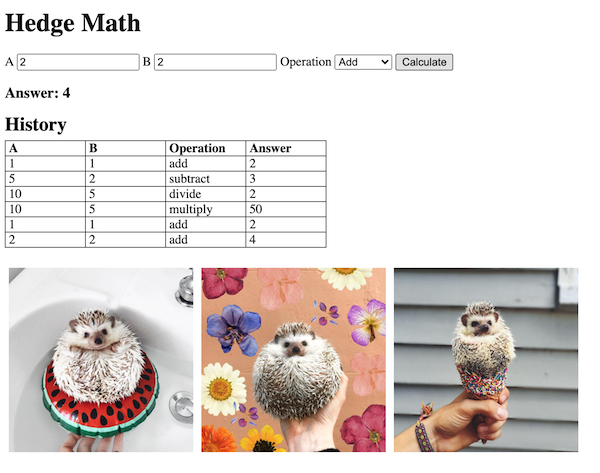

# math-server

## Introduction

This repo has a simple client that allows the user to perform basic math operations on two numbers. As the user performs operations a table containing the history of math operations gets populated. The client code is located in the `dist/` folder.

Your task is to build the server to support this client. The server can be built by only writing code in the `/server/server.js` file though you should feel free to create any additional files that will help you better organize your server code.

When your server is working correctly you should be able to visit http://localhost:3000 and see a website that looks like this:



## Instructions

 There is no canonical solution so how ever you make the webpage work is a valid solution, though editing the client code is perhaps outside the spirit of the prompt. 

The functionality you must implement:

- [ ] Serve the client (`index.html`) and any other static assets the client needs.
- [ ] Implement a route that responds to a `GET` request for the history of math operations.
- [ ] Implement a route that deals with the `PUT` requests generated to perform math operations.

### Hint

- There is a model called `History` which you can import and use to save and retrieve math operations. To simulate async interactions with a real database both methods return a promise.
- Don't forget about tools like [CURL](https://flaviocopes.com/http-curl/) or [Postman](https://www.postman.com/downloads/) to test your routes as you build your server.

# Server Routes

### Get History

`GET /history` Returns a list of all the math operations performed

Response

`Status: 200 OK`

Body

```JSON
{
  "data": [
  { "a": 1, "b": 1, "operation": "add", "answer": 2 },
  { "a": 5, "b": 2, "operation": "subtract", "answer": 3 },
  { "a": 10, "b": 5, "operation": "divide", "answer": 2 },
  { "a": 10, "b": 5, "operation": "multiply", "answer": 50 }
]
}
```

### Perform Operation

`POST /math/:operation`

| Parameter | Type | In  | Description |
| --------- | ---- | --- | ----------- |
| operation | string | path | String of math operation. One of: 'add', 'subtract', 'multiply' or 'divide' |
| a | number | body | First number for operation |
| b | number | body | Second number for operation |

Response

`Status: 201 CREATED`

Body
```JSON
{
  "answer": 10
}
```
